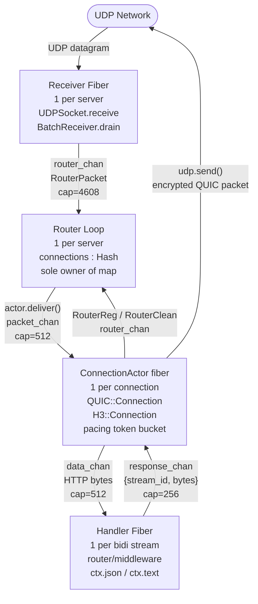
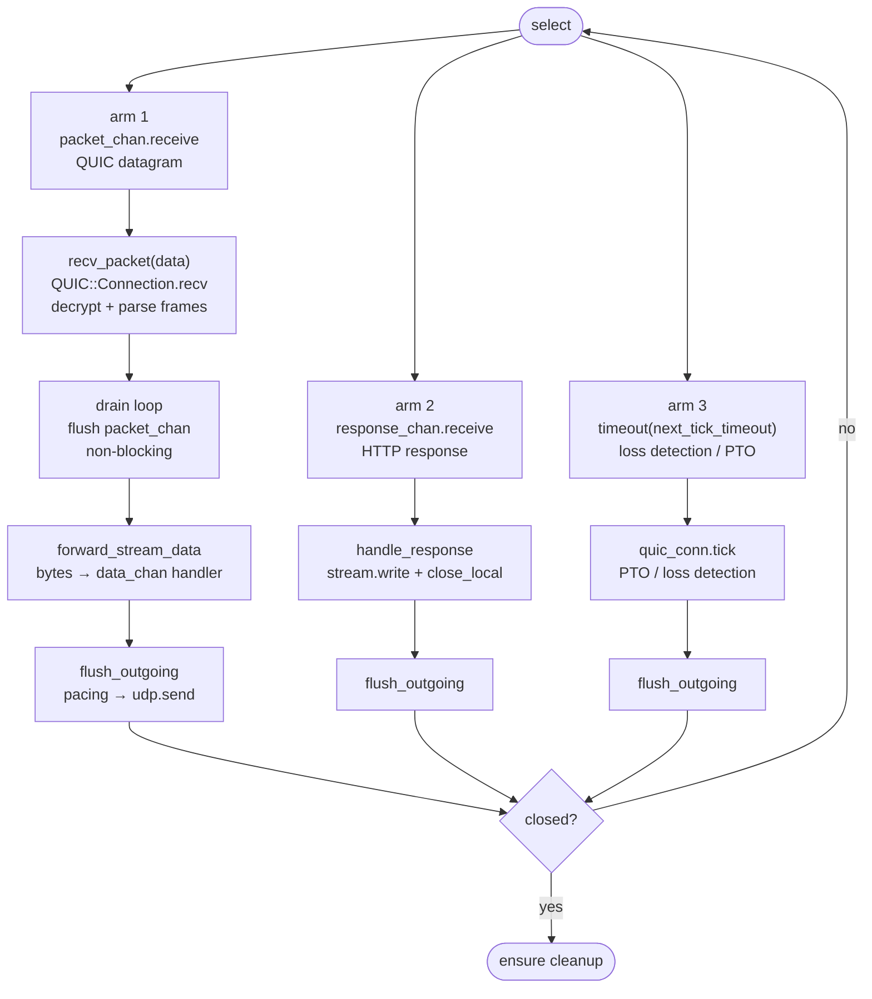
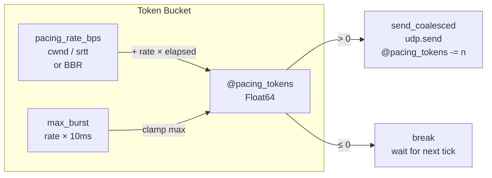
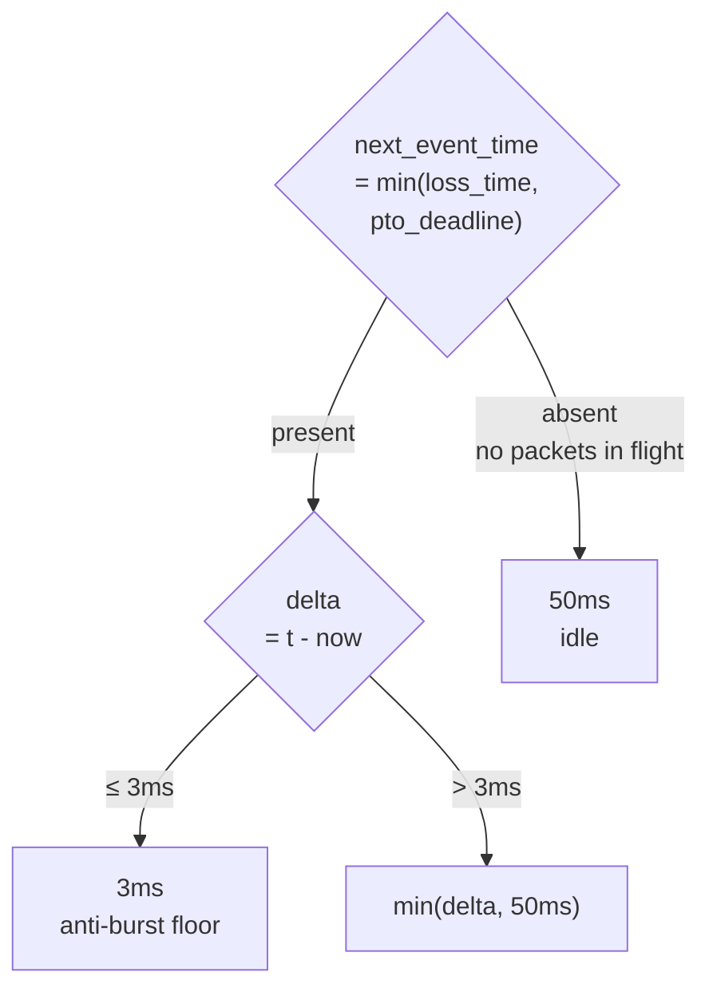
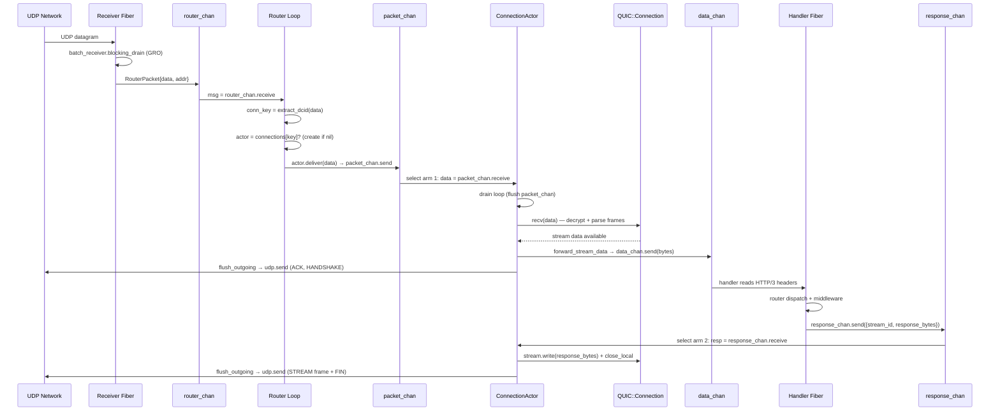
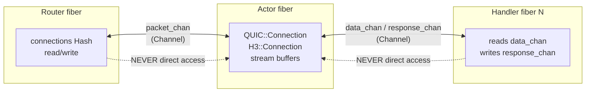
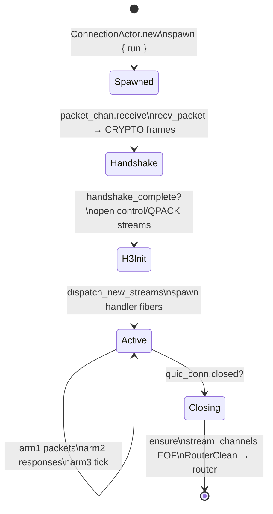
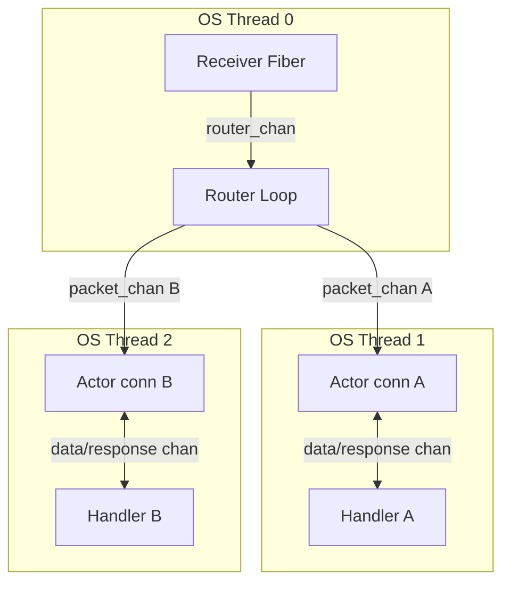

# Actor Model in quic.cr

> **Server-side only.** The pattern is used exclusively by `H3::Server.listen`
> via `H3::ConnectionActor` (`src/h3/connection_actor.cr`, `src/h3/server.cr`).
> `H3::Client` **does not use** the actor model: it manages the connection directly
> in the calling fiber with a `Channel(Bool)` to synchronise the handshake and
> `spawn` for the receive loop — a simpler design suited to a single outbound connection.

The server needs the actor model because it handles **N simultaneous connections
from different peers** on a single `UDPSocket`. Each connection has its own
independent QUIC state (TLS keys, packet number spaces, streams, recovery) that
cannot be shared between fibers without mutexes. Assigning a dedicated fiber per
connection eliminates the problem at the root: no sharing, no locks.

Each QUIC connection has a dedicated fiber (`ConnectionActor`) that exclusively owns
its state — communication only via `Channel`.

---

## Component overview



---

## Full flow — from UDP datagram to HTTP response

This section describes step by step everything that happens from the arrival of a
UDP datagram to sending the HTTP/3 response to the client.

### 1. Receiver Fiber — listening on the network

The `Receiver Fiber` is the sole point of contact with the UDP socket. It blocks on
`blocking_drain(udp)`, which internally uses `epoll` (Linux) and does not consume CPU
while waiting. When a datagram arrives, the OS wakes the fiber.

`blocking_drain` calls `recvmmsg` with `MSG_DONTWAIT` to read in one shot all
datagrams already present in the kernel receive buffer, without additional syscalls.
With UDP GRO enabled, the kernel coalesces equal-size datagrams from the same source
into one large buffer per slot; `each_segment` splits them by `gso_size`. Each
datagram is copied and sent to `router_chan` as a `RouterPacket`.

The Receiver Fiber knows nothing about QUIC — it works only with raw bytes and IP
addresses. This keeps it simple and fast.

### 2. Router Loop — routing connections

The Router Loop receives messages from `router_chan` and is the sole fiber that reads
and writes the `connections : Hash(String, ConnectionActor)` map. No mutex is needed
on this map because only this fiber touches it.

When a `RouterPacket` arrives, the Router extracts the DCID (Destination Connection
ID) from the first bytes of the QUIC datagram and uses it as a lookup key. If no
actor is found for that DCID, it checks whether there is an actor associated with the
source IP address (fallback for packets that arrive before the SCID is registered).

If no actor exists for this connection, the Router creates:
- a `QUIC::Connection` with the TLS configuration
- an `H3::Connection` that maps QUIC streams to HTTP/3 semantics
- a `ConnectionActor` that spawns the fiber and starts running

The Router then calls `actor.deliver(data)`, a non-blocking send on the actor's
`packet_chan`. If the channel were full (beyond 512 slots), the datagram would be
silently dropped — UDP is unreliable by design and QUIC handles retransmission at
the application level.

The Router also handles two control messages from the actor:
- `RouterReg`: the actor has completed the handshake and knows its definitive SCID —
  the Router adds the new alias to the map for future lookups.
- `RouterClean`: the actor has closed — the Router removes all entries.

### 3. ConnectionActor — the heart of the connection

The actor is a single Crystal fiber running in a `select` loop with three arms. It
exclusively owns `QUIC::Connection` and `H3::Connection` — no other fiber ever
touches them.



**Arm 1 — incoming packet**: The raw datagram is passed to `QUIC::Connection.recv`,
which unmasks the header (header protection), decrypts the payload (AEAD AES-128-GCM),
and dispatches the contained frames: `CRYPTO` for the TLS handshake, `STREAM` for
HTTP data, `ACK` for recovery updates, etc.

After `recv_packet`, the drain loop flushes all of `packet_chan` with a non-blocking
`select+else`. This is critical for performance: instead of making a round-trip in
`select` for every packet (700 times for 1 MB), all bytes are accumulated in the
stream buffers and `flush_outgoing` is called just once.

**Arm 2 — HTTP response**: A handler fiber has finished building the response and
sends it on `response_chan`. The actor writes the bytes to the QUIC stream object
and calls `close_local` to append the FIN bit.

**Arm 3 — timer**: Fires when the timeout computed by `next_tick_timeout` expires.
Calls `quic_conn.tick`, which evaluates whether the Loss Detection Timer has expired
(declare packets lost) or whether the PTO (Probe Timeout) has expired (send a probe
to verify the network is alive).

### 4. HTTP/3 stream dispatch

When `recv_packet` sees a stream with ID % 4 == 0 (client-initiated bidirectional
stream, RFC 9000 §2.1), it spawns a new handler fiber.

```mermaid
sequenceDiagram
    participant Actor as ConnectionActor
    participant SC as stream_channels (Map)
    participant HF as Handler Fiber (req-N)
    participant Sck as ActorStreamSocket

    Actor->>SC: data_chan = Channel(Bytes).new(512)
    Actor->>SC: stream_channels[stream_id] = data_chan
    Actor->>Sck: sock = ActorStreamSocket.new(stream_id, data_chan, self)
    Actor->>HF: spawn { server.handle_request(h3_conn, sock) }

    note over Actor,HF: Handler fiber reads HTTP/3 headers via sock.read()
    note over Actor,HF: which blocks on data_chan.receive

    Actor->>SC: forward_stream_data: stream.read → data_chan.send
    data_chan-->>HF: bytes received from peer
    HF->>HF: router/middleware dispatch
    HF->>Actor: response_chan.send({stream_id, bytes})
    Actor->>Actor: handle_response: stream.write + close_local
    Actor->>Actor: flush_outgoing → udp.send(STREAM frame + FIN)
```

`ActorStreamSocket` is an `IO` that reads from `data_chan` and writes to
`response_chan`. Handlers can use it with any Crystal IO-aware API (`gets`, `puts`,
etc.) without knowing anything about QUIC or the underlying actor.

### 5. Pacing — rate-limited sending

`flush_outgoing` implements a token bucket to avoid micro-bursts:



`@pacing_tokens` starts at `Float64::MAX` so the handshake and slow-start are never
throttled. The rate is provided by `Recovery.pacing_rate_bps`: uses BBR
`max_bandwidth × 1.25` when available, otherwise `cwnd / srtt`.

### 6. Dynamic timer — waking up at the right time

The `timeout(next_tick_timeout)` computes when the next event is expected:



The 3ms floor is necessary on loopback: aioquic sends ACKs in batches every ~1ms
(asyncio event loop). With RTT ~2ms, `loss_time = T+2.25ms`. Without the floor the
timer would fire at T+2.25ms, before the second ACK batch at T+3ms → false positives
→ `cwnd` halved → PTO stall. The floor ensures the next batch has already arrived
when the timer wakes up.

---

## Full sequence diagram — UDP in → HTTP response out



---

## Channels and types

| Channel | Type | Capacity | From → To | Purpose |
|---------|------|----------|-----------|---------|
| `router_chan` | `Channel(RouterMsg)` | 4608 | Receiver / Actor → Router | all messages to the router |
| `packet_chan` | `Channel(Bytes)` | 512 | Router → Actor | raw QUIC datagrams |
| `response_chan` | `Channel({UInt64, Bytes})` | 256 | Handler fiber → Actor | encoded HTTP response |
| `data_chan` (bidi stream) | `Channel(Bytes)` | 512 | Actor → Handler fiber | bytes received from peer |
| `data_chan` (uni stream) | `Channel(Bytes)` | 16 | Actor → Uni handler | QPACK encoder/decoder/control |

### RouterMsg — structured union type

```crystal
record RouterPacket, data : Bytes, addr : Socket::IPAddress
record RouterReg,    key : String, actor : ConnectionActor
record RouterClean,  key : String, addr_key : String
alias RouterMsg = RouterPacket | RouterReg | RouterClean
```

Three `record` types instead of tuples allow the Crystal compiler to narrow types
in `case/when` without ambiguity in `select` unions.

---

## No-mutex invariant



`QUIC::Connection` and `H3::Connection` never need locks because they are only
accessible from the actor's fiber. Router and handlers communicate exclusively via
channels. Crystal channels are thread-safe by design.

---

## Actor lifecycle



The `ensure` at the end of `run` guarantees cleanup even on exception: it sends
`Bytes.empty` on all open `data_chan`s (EOF signal to handlers) and sends
`RouterClean` to the Router to remove entries from the map.

---

## Multithreading with `-Dpreview_mt`

With the `-Dpreview_mt` build flag, Crystal assigns fibers to OS threads from the
system pool. Different actors run on different cores without code changes — `Channel`s
are thread-safe by design.



Reference files: `src/h3/connection_actor.cr`, `src/h3/server.cr`
