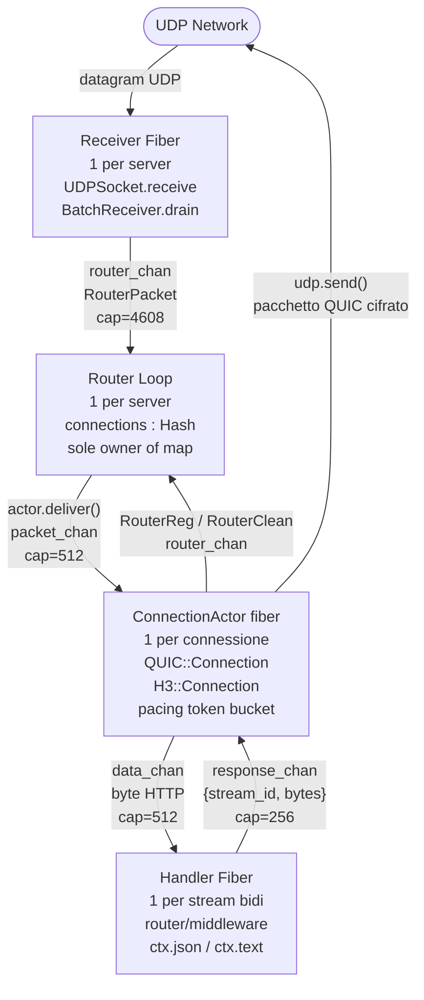
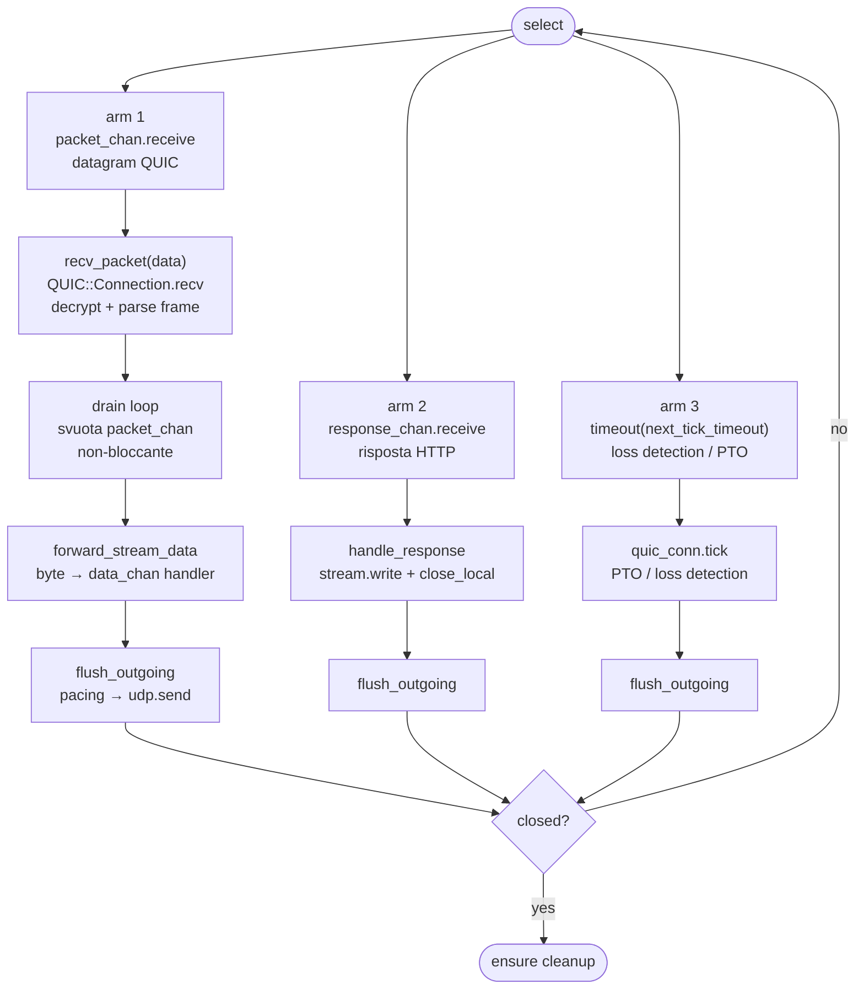
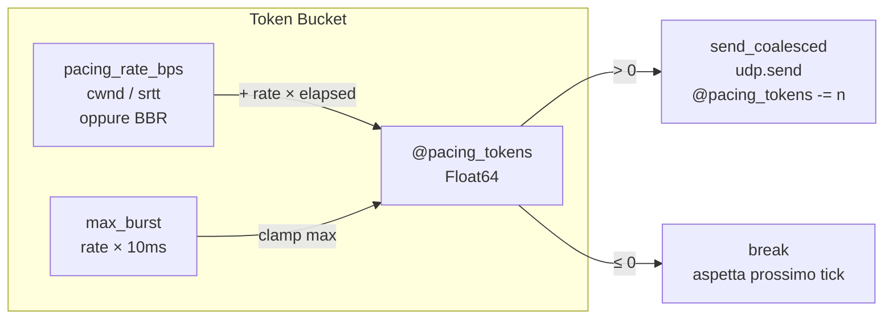
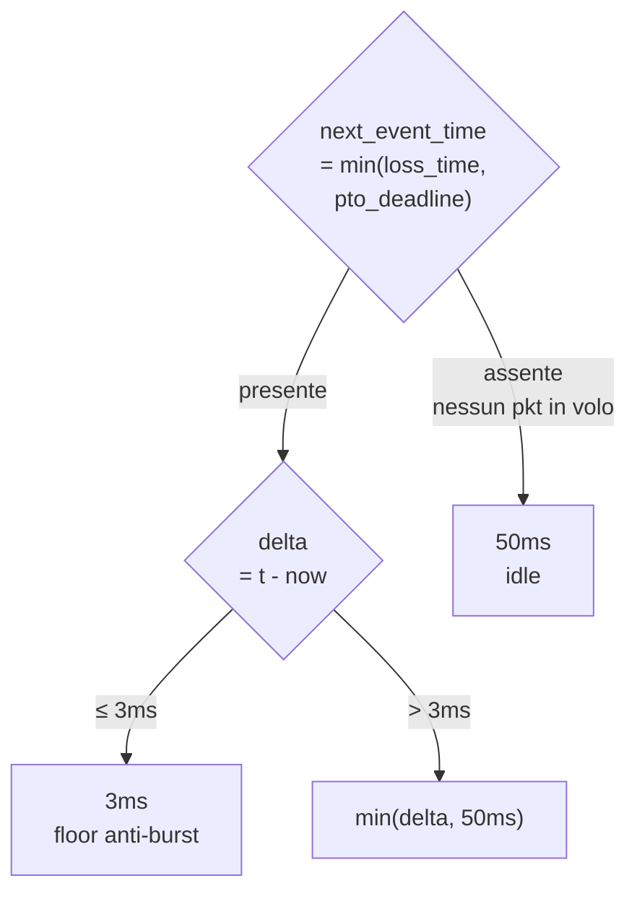
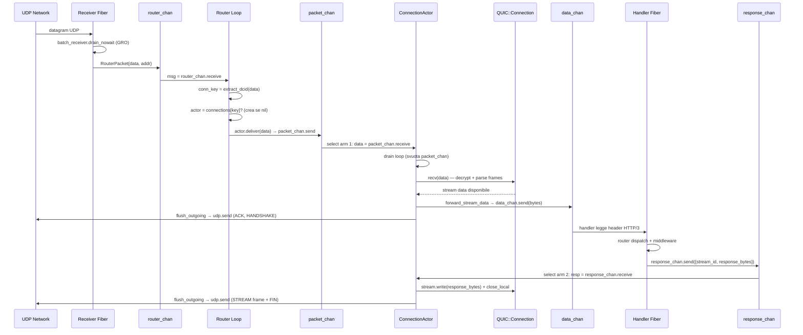
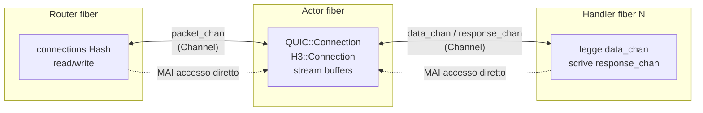
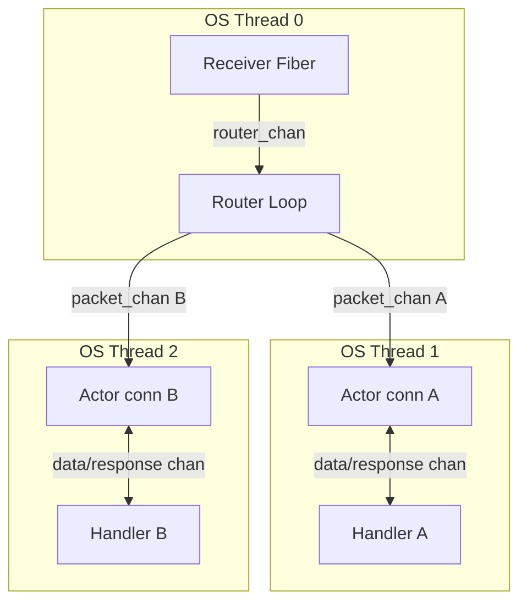

# Actor Model in quic.cr

> **Lato server only.** Il pattern è adottato esclusivamente da `H3::Server.listen`
> tramite `H3::ConnectionActor` (`src/h3/connection_actor.cr`, `src/h3/server.cr`).
> `H3::Client` **non usa** l'actor model: gestisce la connessione direttamente nel
> fiber chiamante con un `Channel(Bool)` per sincronizzare l'handshake e `spawn` per
> il receive loop — un design più semplice adatto a una singola connessione outbound.

Il server ha bisogno dell'actor model perché gestisce **N connessioni simultanee
da peer diversi** su un singolo `UDPSocket`. Ogni connessione ha il suo stato QUIC
indipendente (chiavi TLS, packet number spaces, stream, recovery) che non può essere
condiviso tra fiber senza mutex. Assegnare un fiber dedicato per connessione elimina
il problema alla radice: nessuna condivisione, nessun lock.

Ogni connessione QUIC ha un fiber dedicato (`ConnectionActor`) che possiede lo stato
in esclusiva — comunicazione solo via `Channel`.

---

## Panoramica dei componenti



---

## Flusso completo — dal datagram UDP alla response HTTP

Questa sezione descrive passo per passo tutto quello che succede dall'arrivo
di un datagram UDP fino all'invio della risposta HTTP/3 al client.

### 1. Receiver Fiber — ascoltare la rete

Il `Receiver Fiber` è il solo punto di contatto con il socket UDP. Si blocca
su `udp.receive(buf)`, che internamente usa `epoll` (Linux) e non consuma CPU
in attesa. Quando arriva un datagram, il sistema operativo sveglia il fiber.

Dopo il primo datagram, viene chiamato `batch_receiver.drain_nowait` che usa
`recvmmsg` (GRO — Generic Receive Offload) per leggere in un colpo solo tutti
i datagram già presenti nel kernel receive buffer, senza ulteriori syscall.
Ogni datagram viene copiato e inviato al `router_chan` come `RouterPacket`.

Il Receiver Fiber non sa nulla di QUIC — lavora solo con byte grezzi e
indirizzi IP. Questo lo mantiene semplice e veloce.

### 2. Router Loop — smistare le connessioni

Il Router Loop riceve i messaggi dal `router_chan` ed è il solo fiber che
legge e scrive la mappa `connections : Hash(String, ConnectionActor)`.
Non serve un mutex su questa mappa perché solo questo fiber la tocca.

Quando arriva un `RouterPacket`, il Router estrae il DCID (Destination
Connection ID) dai primi byte del datagram QUIC e lo usa come chiave di
lookup. Se non trova un actor per quel DCID, controlla se c'è un actor
associato all'indirizzo IP sorgente (fallback per i pacchetti che arrivano
prima della registrazione del SCID).

Se non esiste nessun actor per questa connessione, il Router crea:
- un `QUIC::Connection` con la configurazione TLS
- un `H3::Connection` che mappa gli stream QUIC in semantica HTTP/3
- un `ConnectionActor` che lancia il fiber e parte

Il Router poi chiama `actor.deliver(data)`, che è una send non-bloccante
sul `packet_chan` dell'actor. Se il canale fosse pieno (oltre 512 slot),
il datagram verrebbe scartato silenziosamente — UDP è unreliable per design
e QUIC gestisce la ritrasmissione a livello applicativo.

Il Router gestisce anche due messaggi di controllo dall'actor:
- `RouterReg`: l'actor ha completato l'handshake e conosce il suo SCID
  definitivo — il Router aggiunge il nuovo alias alla mappa per lookup futuro.
- `RouterClean`: l'actor si è chiuso — il Router rimuove tutte le entry.

### 3. ConnectionActor — il cuore della connessione

L'actor è un singolo fiber Crystal che gira in un loop `select` con tre
braccia. Possiede in esclusiva `QUIC::Connection` e `H3::Connection` —
nessun altro fiber li tocca mai.



**Arm 1 — pacchetto in arrivo**: Il datagram grezzo viene passato a
`QUIC::Connection.recv`, che decifra l'header (header protection), decifra
il payload (AEAD AES-128-GCM), e dispatcha i frame contenuti: `CRYPTO` per
il TLS handshake, `STREAM` per i dati HTTP, `ACK` per l'aggiornamento del
recovery, ecc.

Dopo `recv_packet`, il drain loop svuota tutto il `packet_chan` con un
`select+else` non-bloccante. Questo è critico per la performance: invece di
fare un round-trip nel `select` per ogni pacchetto (700 volte per 1 MB),
si accumulano tutti i byte nei buffer stream e poi si chiama `flush_outgoing`
una volta sola.

**Arm 2 — risposta HTTP**: Un handler fiber ha terminato di costruire la
risposta e la invia su `response_chan`. L'actor scrive i byte sull'oggetto
stream QUIC e chiama `close_local` per appendere il bit FIN.

**Arm 3 — timer**: Scatta quando scade il timeout calcolato da
`next_tick_timeout`. Chiama `quic_conn.tick` che valuta se il Loss Detection
Timer è scaduto (dichiarare pacchetti persi) o se è scaduto il PTO (Probe
Timeout, inviare un probe per verificare che la rete sia attiva).

### 4. Dispatch degli stream HTTP/3

Quando `recv_packet` vede uno stream con ID % 4 == 0 (stream bidirezionale
client-initiated, RFC 9000 §2.1), lancia un nuovo handler fiber.

```mermaid
sequenceDiagram
    participant Actor as ConnectionActor
    participant SC as stream_channels (Map)
    participant HF as Handler Fiber (req-N)
    participant Sck as ActorStreamSocket

    Actor->>SC: data_chan = Channel(Bytes).new(512)
    Actor->>SC: stream_channels[stream_id] = data_chan
    Actor->>Sck: sock = ActorStreamSocket.new(stream_id, data_chan, self)
    Actor->>HF: spawn { server.handle_request(h3_conn, sock) }

    note over Actor,HF: Handler fiber legge header HTTP/3 via sock.read()
    note over Actor,HF: che blocca su data_chan.receive

    Actor->>SC: forward_stream_data: stream.read → data_chan.send
    data_chan-->>HF: bytes ricevuti dal peer
    HF->>HF: router/middleware dispatch
    HF->>Actor: response_chan.send({stream_id, bytes})
    Actor->>Actor: handle_response: stream.write + close_local
    Actor->>Actor: flush_outgoing → udp.send(STREAM frame + FIN)
```

`ActorStreamSocket` è un `IO` che legge da `data_chan` e scrive su
`response_chan`. Gli handler possono usarlo con qualsiasi API Crystal IO-aware
(`gets`, `puts`, ecc.) senza sapere nulla di QUIC o dell'actor sottostante.

### 5. Pacing — invio cadenzato

`flush_outgoing` implementa un token bucket per evitare micro-burst:



`@pacing_tokens` inizia a `Float64::MAX` così l'handshake e lo slow-start
non sono mai throttlati. Il rate viene fornito da `Recovery.pacing_rate_bps`:
usa BBR `max_bandwidth × 1.25` quando disponibile, altrimenti `cwnd / srtt`.

### 6. Timer dinamico — svegliarsi al momento giusto

Il `timeout(next_tick_timeout)` calcola quando il prossimo evento è atteso:



Il floor di 3ms è necessario su loopback: aioquic invia ACK in batch ogni
~1ms (asyncio event loop). Con RTT ~2ms, `loss_time = T+2.25ms`. Senza floor
il timer scatterebbe a T+2.25ms, prima del secondo batch ACK a T+3ms → falsi
positivi → `cwnd` dimezzato → stallo da PTO. Il floor garantisce che il batch
successivo sia già arrivato quando il timer si sveglia.

---

## Sequence diagram completo — UDP in → HTTP response out



---

## Canali e tipi

| Canale | Tipo | Capacità | Da → A | Scopo |
|--------|------|----------|---------|-------|
| `router_chan` | `Channel(RouterMsg)` | 4608 | Receiver / Actor → Router | tutti i messaggi verso il router |
| `packet_chan` | `Channel(Bytes)` | 512 | Router → Actor | datagram QUIC grezzi |
| `response_chan` | `Channel({UInt64, Bytes})` | 256 | Handler fiber → Actor | risposta HTTP codificata |
| `data_chan` (per stream bidi) | `Channel(Bytes)` | 512 | Actor → Handler fiber | byte ricevuti dal peer |
| `data_chan` (stream uni) | `Channel(Bytes)` | 16 | Actor → Uni handler | QPACK encoder/decoder/control |

### RouterMsg — union type strutturato

```crystal
record RouterPacket, data : Bytes, addr : Socket::IPAddress
record RouterReg,    key : String, actor : ConnectionActor
record RouterClean,  key : String, addr_key : String
alias RouterMsg = RouterPacket | RouterReg | RouterClean
```

I tre `record` invece di tuple permettono al compilatore Crystal di fare
narrowing nel `case/when` senza ambiguità di tipo nei `select` union.

---

## Invariante no-mutex



`QUIC::Connection` e `H3::Connection` non hanno mai lock perché sono
accessibili solo dal fiber dell'actor. Router e handler comunicano
esclusivamente via canali. I canali Crystal sono thread-safe per design.

---

## Ciclo di vita dell'actor


L'`ensure` alla fine di `run` garantisce il cleanup anche in caso di
eccezione: invia `Bytes.empty` su tutti i `data_chan` aperti (segnale EOF
agli handler) e invia `RouterClean` al Router per rimuovere le entry dalla mappa.

---

## Multithreading con `-Dpreview_mt`

Con il flag di build `preview_mt`, Crystal assegna i fiber agli OS thread
dal pool di sistema. Actor diversi girano su core diversi senza modifiche
al codice — i `Channel` sono thread-safe per design.



File di riferimento: `src/h3/connection_actor.cr`, `src/h3/server.cr`
