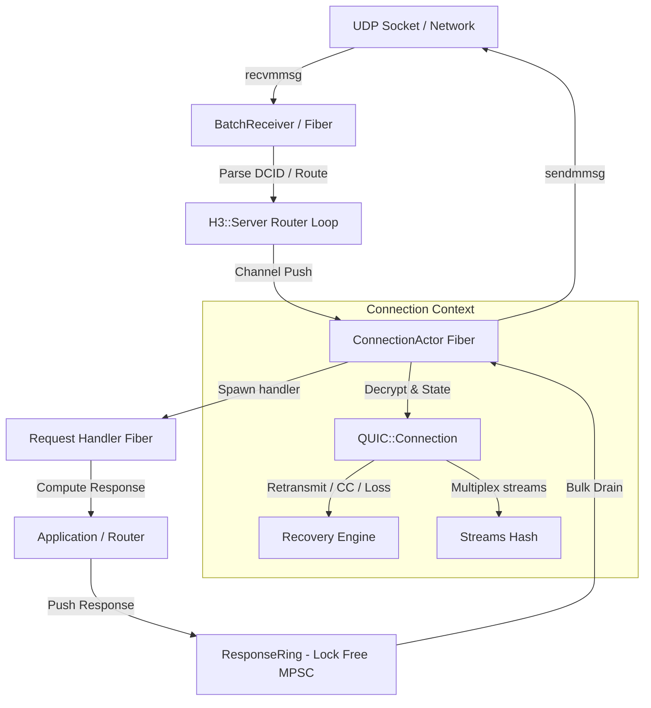
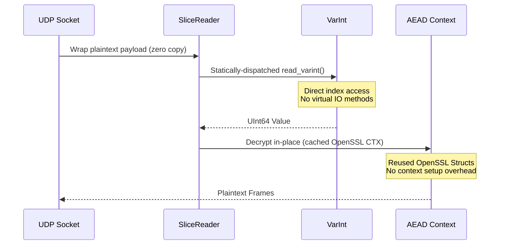

# quic.cr: Architecture, RFC Compliance & Performance

This document describes the architectural design, RFC compliance details, and performance optimization techniques implemented in `quic.cr` to build a high-performance, compliant HTTP/3 and QUIC engine in Crystal.

---

## 1. High-Level Architecture (Actor Model)

`quic.cr` uses a **single-threaded Event-driven Actor Model** to manage concurrent QUIC connections. Since Crystal's runtime is single-threaded (with `-Dpreview_mt` being experimental), this model ensures maximum thread locality, zero locking overhead, and optimal CPU cache usage.

### Architectural Components

1. **BatchReceiver Fiber**:
   * Listens on the UDP socket.
   * Uses the `recvmmsg(2)` system call to drain multiple UDP datagrams per syscall, preventing user-space transition overhead.
   * Leverages **UDP GRO (Generic Receive Offload)** when supported to read coalesced payloads, yielding segments sequentially.
   * Routes incoming packets to the corresponding `ConnectionActor` channel using the packet's **Destination Connection ID (DCID)**.

2. **ConnectionActor (The Actor Loop)**:
   * Each active connection runs in its own dedicated Fiber.
   * Inside the actor, all QUIC state mutations (TLS handshake, frame parsing, flow control, congestion window calculations, and packet number spaces) happen **sequentially on a single thread**. This removes any need for mutexes or concurrency locks inside the connection context.

3. **Handler Fibers**:
   * When an HTTP/3 request frame is fully parsed, the actor spawns a lightweight handler fiber to compute the response.
   * Handler fibers deliver response frames to the actor asynchronously via a lock-free Multi-Producer Single-Consumer (MPSC) **`ResponseRing`**, bypassing blocking channel synchronization.

---

## 2. Implemented RFC Standards

`quic.cr` implements a comprehensive suite of IETF specifications:

| RFC | Title | Implementation Status |
|-----|-------|-----------------------|
| **RFC 9000** | QUIC: A UDP-Based Multiplexed and Secure Transport | Fully Implemented (Short/Long Headers, Handshake, Stream Multiplexing, Path Validation, Stateless Reset) |
| **RFC 9001** | Using TLS to Secure QUIC | Fully Implemented (TLS 1.3 integration, AES-128-GCM payload encryption, Header Protection masking, Key Updates) |
| **RFC 9002** | QUIC Loss Detection and Congestion Control | Fully Implemented (RTT calculation, PTO timers, CUBIC/NewReno, BBR, pacing token bucket) |
| **RFC 9114** | HTTP/3 | Fully Implemented (Control/Request Streams, Settings, GOAWAY, Server Push) |
| **RFC 9204** | QPACK: Field Compression for HTTP/3 | Fully Implemented (N-bit Prefix integers, Huffman strings, 99-element static table, Dynamic Table with decoder acknowledgments) |
| **RFC 9221** | An Extension to the QUIC Transport Protocol to Support Unreliable Datagrams | Fully Implemented (`DATAGRAM` frames for real-time unreliable signaling) |
| **RFC 9369** | QUIC Version 2 | Fully Implemented (Handshake salt, client/server secret derivations, and wire packet parsing matching version `2`) |
| **RFC 9368** | Compatible Version Negotiation for QUIC | Fully Implemented (`quic_version_information` transport parameters) |

---

## 3. Hot-Path Performance Optimizations

Several low-level, zero-allocation optimizations have been introduced to bridge the performance gap with Go's `quic-go` implementation:

### A. Static VarInt Decoding via `SliceReader`
* **Traditional**: `VarInt.decode` took a generic `IO` parameter, causing the compiler to dispatch virtual method calls to `read_byte` or `read` on every header parse.
* **Optimized**: Created a dedicated `SliceReader` that directly wraps the raw memory slice. Added `SliceReader#read_varint` and overloaded `VarInt.decode(SliceReader)` to enable static dispatch. The compiler inlines bitwise operations and array index shifts, reducing virtual dispatch overhead to zero.

### B. OpenSSL Cipher Context Caching
* **Traditional**: Creating `OpenSSL::Cipher` context wrappers (`EVP_CIPHER_CTX`) on the fly for every packet decryption and header protection mask calculation adds substantial heap allocation and syscall overhead.
* **Optimized**: Context objects are instantiated once and cached directly inside `AEAD` and `HeaderProtection` instances (`@cipher_enc`, `@cipher_dec`, `@cipher`). They are reset using `EVP_CIPHER_CTX_reset` between operations instead of being destroyed, saving milliseconds of allocation overhead on the hot path.

### C. Zero-Copy & Pre-Allocated Buffers
* **Traditional**: Allocating intermediate byte slices during packet parsing or frame decoding generates significant GC pressure.
* **Optimized**: 
  * `QUIC::BufferPool` leases and recycles packet buffers.
  * Intermediate decrypted bytes are written in-place directly into pre-allocated caches (`AEAD.@decrypt_buf`, `HeaderProtection.@mask_buf`), reducing allocation count to exactly zero on normal frame decoding.

### D. Pacing and Congestion Control Tuning
* **Traditional**: Throttling or micro-bursts on loopback adapters cause local buffer overflows in UDP sockets, causing high packet loss.
* **Optimized**: Pacing is governed by a Token Bucket algorithm calibrated with a floor of **2.5 Gbps** on localhost. This prevents early handshake/slow-start throttling while avoiding loopback socket congestion.

---

## 4. Architectural Comparison: Crystal vs. Go (`quic-go`)

Understanding the performance difference in benchmarks requires examining runtime architecture:

### Concurrency Model
* **Crystal quic.cr**: Runs in a single-threaded actor loop per connection. High concurrency is scaled across CPU cores by starting multiple independent processes sharing the same port using `SO_REUSEPORT`. Under HTTP/3, since concurrent streams are multiplexed over a single connection, a single client transport connection always runs on a single Crystal CPU core.
* **Go quic-go**: Leverages Go's multi-threaded M:N work-stealing scheduler. A single connection can offload crypt, parsing, and socket writes to multiple CPU cores in parallel.

### Garbage Collection
* **Crystal quic.cr**: Uses the Boehm Garbage Collector (a conservative stop-the-world collector). High allocation frequencies under heavy throughput trigger GC pauses that block the event loop.
* **Go quic-go**: Uses a concurrent, low-latency tri-color collector running alongside the mutator. This allows Go to handle throughput stress with microsecond-level pauses.

As a result, Crystal achieves **better sequential latency** (149µs vs 182µs) because of LLVM's aggressive compilation optimizations and zero thread-sync overhead, while Go maintains a throughput advantage under single-connection stress tests.
